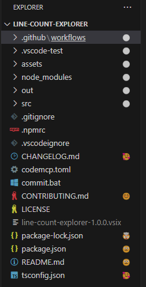
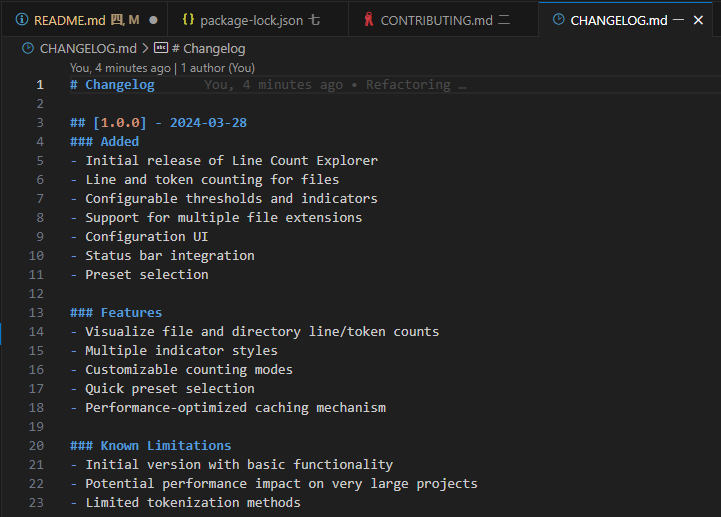

# Line Count Explorer

A Visual Studio Code extension that adds line and token count decorations to your file explorer, helping you quickly identify large files that might need refactoring.

## Features

- 📊 Visual line and token count indicators
- 🎨 Multiple indicator styles (circles, emojis, icons)
- 🔧 Customizable thresholds and file extensions
- ⚙️ Configurable counting modes (lines or tokens)
- 🚀 Quick preset selection
- 📈 Status bar integration
- ⚡ High-performance parallel processing

## Screenshots




## Quick Start

1. Install the extension from the VS Code Marketplace
2. Open your project
3. See file size indicators in the explorer view

## Configuration

### Counting Modes

Choose between:
- Lines count
- Tokens count (useful for LLM context window estimation)

## Presets and Customization

### Presets

Line Count Explorer now supports customizable presets to quickly switch between different configurations:

**Built-in presets:**
- **Default**: General purpose line count thresholds
- **LLM Context**: Token-based thresholds matching common LLM context window sizes
- **Code Review**: Metrics tailored for code review complexity
- **Documentation**: Specialized for documentation file sizes

**Custom presets:**
- Create your own presets with your preferred settings
- Save current configuration as a preset
- Import and export presets as JSON files
- Manage presets through the command palette

### Custom Thresholds

Easily define your own threshold levels using comma-separated values:

```
0, 100, 500, 1000, 2000, 5000, 10000
```

Presets automatically use the selected indicator symbol set, or you can choose a different set for each preset.

## Commands

### Configuration
- `Line Count Explorer: Open Configuration UI` - Opens VS Code settings for the extension
- `Line Count Explorer: Toggle Extension` - Enable or disable the extension
- `Line Count Explorer: Refresh Counts` - Manually refresh all line counts (also available in explorer context menu)
- `Line Count Explorer: Cancel Indexing Operation` - Stop an in-progress indexing operation
- `Line Count Explorer: Clear Caches` - Free memory by clearing the internal caches

### Presets
- `Line Count Explorer: Quick Select Preset` - Quickly select and apply a preset
- `Line Count Explorer: Save Current Config as Preset` - Save your current settings as a custom preset
- `Line Count Explorer: Manage Presets` - View, apply or delete your custom presets

### Visual Indicators
- `Line Count Explorer: Change Indicator Symbol Set` - Switch to a different symbol set
- `Line Count Explorer: Set Custom Thresholds` - Set custom threshold values with comma-separated numbers
- `Line Count Explorer: Import Symbol Sets from CSV` - Import custom symbol sets from CSV format

## Indicator Styles

Choose from 30+ different symbol sets to visualize file sizes:

- **Colored Circles**: ⚪ 🔵 🟢 🟡 🟠 🔴 ⛔ (default)
- **Emoji Faces**: 😀 🙂 😐 🙁 😟 😰 🤯
- **Documentation Icons**: 📝 📄 📑 📚 📔 📙 📘
- **Numbers**: 1 2 3 4 5 6 7
- **Weather**: ☀️ 🌤️ ⛅ 🌥️ ☁️ 🌧️ ⛈️
- **Animals**: 🐜 🐁 🐈 🐕 🦊 🐎 🐘
- **Space**: ⚛️ 🔬 🛰️ 🌎 🪐 ☀️ 🌌
- ...and 20+ more sets

You can also import custom symbol sets from CSV format.

## Performance Optimizations

The v2.0.0 release includes significant performance improvements:

- **Parallel Processing**: Files are processed in batches to maximize throughput
- **Prioritized Indexing**: Open files and visible files are processed first
- **Asynchronous I/O**: Non-blocking file operations for better responsiveness
- **Smart Caching**: More efficient memory usage in large workspaces
- **Cancelable Operations**: Stop long-running operations at any time
- **Progress Reporting**: Visual feedback during indexing operations
- **Memory Management**: Ability to clear caches and reduce memory footprint
- **Optimized Algorithms**: More efficient line and token counting
- **Event-Based Architecture**: Reduced polling for better performance
- **Workspace Exclusions**: Common directories like node_modules are automatically ignored

These enhancements result in:
- Up to 5x faster indexing for large workspaces
- Significantly reduced memory consumption
- Improved UI responsiveness during operations
- Better handling of very large files and projects

## Contributing

Contributions welcome! 
- Report issues on GitHub
- Submit pull requests
- Suggest new features

## License

MIT License

## Created By

Dmytro Yemelianov
[GitHub](https://github.com/dmytrove)
[Website](https://dmytrove.com)